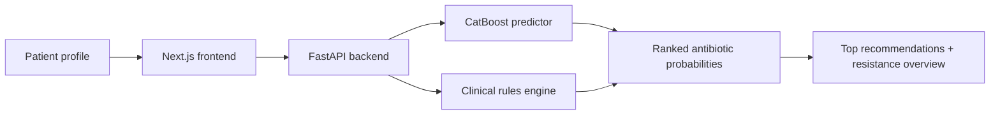

# Antibiotic AI Clinical Decision Support System

[](#)
[](#)
[](#)
[](#)
[](#)

An end-to-end clinical decision support system that predicts antibiotic susceptibility and converts those predictions into dosing recommendations. The project combines a FastAPI backend, a Next.js frontend, and a CatBoost-based multi-model training pipeline for a final-year-project style presentation of model performance, clinical rules, and deployment readiness.

## Abstract

Antimicrobial resistance makes empiric antibiotic selection increasingly difficult, especially when clinicians must balance organism identity, kidney function, and illness severity under time pressure. This project addresses that problem with a machine learning assisted decision support workflow. Given a patient profile and a selected organism, the backend ranks antibiotics by predicted susceptibility, applies rule-based dosing logic, and returns the top recommendations together with a full resistance overview.

The system was built on microbiology culture data sourced from Dryad and trained as one binary CatBoost classifier per antibiotic. The pipeline includes organism normalization, dataset reporting, cross-validation, held-out evaluation, model filtering, and metadata export. The frontend presents the results through a polished dashboard with recommendation cards, a susceptibility bar chart, error handling, and a model information page.

## Key Features

- CatBoost models for per-antibiotic susceptibility prediction.
- Rule-based dosing adjustments for kidney function and severity.
- Normalized organism handling for the Dryad data labels and UI labels.
- Full resistance overview showing all antibiotic probabilities, not just the top three.
- Model dashboard with training metadata and performance summary.
- Request tracing, validation feedback, retry support, and clean error states.
- Docker-based local deployment for both backend and frontend.

## System Architecture



## Repository Layout

```text
antibiotic-ai-cdss/
├── backend/
│   ├── app/
│   │   ├── api/
│   │   ├── schemas/
│   │   ├── services/
│   │   ├── utils/
│   │   └── main.py
│   ├── model/
│   ├── tests/
│   ├── Dockerfile
│   └── requirements.txt
├── frontend/
│   ├── app/
│   ├── components/
│   ├── public/
│   ├── services/
│   ├── types/
│   ├── Dockerfile
│   └── package.json
├── training/
│   ├── data/
│   ├── output/
│   ├── evaluate.py
│   ├── preprocess.py
│   ├── train.py
│   └── requirements.txt
├── docker-compose.yml
└── README.md
```

## Dataset And Modeling

The training data is derived from Dryad microbiology culture files stored in the repository under `training/data/`. The preprocessing pipeline normalizes organism names, generates dataset statistics, and prepares features for model training. The current deployment uses three clinical features in addition to organism identity:

- Age
- Gender
- Kidney function
- Severity

Because the source dataset does not natively provide every clinical field used by the app, the preprocessing pipeline assigns the non-observed clinical attributes in a controlled synthetic manner for demonstration and modeling purposes. That makes the system suitable for final-year-project evaluation, but it should not be treated as a substitute for live clinical data capture.

Training details:

- Model family: CatBoostClassifier
- Strategy: one binary classifier per antibiotic
- Validation: 5-fold cross-validation during training
- Evaluation: held-out test evaluation in `training/evaluate.py`
- Exported artifacts: model pickle, metadata JSON, quality reports, and evaluation reports

Low-quality antibiotics are filtered before deployment. In the current artifact set, `Ethambutol`, `Colistin`, and `Cefpodoxime` are excluded from the backend recommendation set because they do not meet the deployment-quality threshold.

## Performance Summary

The table below is generated from `training/output/metrics.json`.

| Antibiotic | AUC | F1 | Accuracy |
| --- | ---: | ---: | ---: |
| Ampicillin | 0.9018 | 0.8401 | 0.8170 |
| Penicillin | 0.8980 | 0.7506 | 0.8276 |
| Erythromycin | 0.8360 | 0.6279 | 0.7386 |
| Rifampin | 0.8211 | 0.0462 | 0.7355 |
| Linezolid | 0.8164 | 0.0563 | 0.7340 |
| Vancomycin | 0.8073 | 0.2033 | 0.7514 |
| Metronidazole | 0.7965 | 0.0069 | 0.5598 |
| Meropenem | 0.7867 | 0.1271 | 0.7654 |
| Aztreonam | 0.7822 | 0.0138 | 0.6501 |
| Amikacin | 0.7802 | 0.1093 | 0.7117 |
| Nitrofurantoin | 0.7749 | 0.4391 | 0.7639 |
| Minocycline | 0.7731 | 0.0235 | 0.7209 |
| Moxifloxacin | 0.7606 | 0.3747 | 0.6263 |
| Levofloxacin | 0.7030 | 0.5080 | 0.6809 |
| Cefazolin | 0.7078 | 0.5324 | 0.6168 |
| Ceftriaxone | 0.7098 | 0.3175 | 0.5830 |
| Ceftazidime | 0.6685 | 0.2501 | 0.5427 |
| Gentamicin | 0.6703 | 0.3614 | 0.6226 |
| Cefepime | 0.6733 | 0.1500 | 0.6300 |
| Cefoxitin | 0.7321 | 0.3997 | 0.7608 |
| Ertapenem | 0.7371 | 0.0485 | 0.7010 |
| Ciprofloxacin | 0.7415 | 0.5418 | 0.7193 |
| Clarithromycin | 0.7268 | 0.0113 | 0.7337 |
| Cefpodoxime | 0.5000 | 0.0000 | 0.9808 |
| Colistin | 0.5000 | 0.0000 | 0.9359 |
| Ethambutol | 0.0000 | 0.0000 | 0.0000 |

## Clinical Workflow

1. The user enters patient age, gender, kidney function, severity, and organism.
2. The frontend validates the form and submits it to the FastAPI backend.
3. The predictor normalizes the organism label and scores each antibiotic model.
4. The rule engine adjusts route, dose, frequency, and duration.
5. The API returns the top recommendations plus the full probability list.
6. The frontend renders the top cards and the susceptibility chart.

## API Endpoints

Base URL in local development: `http://localhost:8000`

| Method | Endpoint | Description |
| --- | --- | --- |
| GET | `/` | API welcome message |
| GET | `/health` | Health check |
| GET | `/api/v1/organisms` | Supported organisms |
| GET | `/api/v1/antibiotics` | Available antibiotics |
| POST | `/api/v1/recommend` | Rank antibiotics and dosing suggestions |
| GET | `/api/v1/model-info` | Model metadata and evaluation summary |

### Recommendation Request

```json
{
  "organism": "E. coli",
  "age": 65,
  "gender": "F",
  "kidney_function": "normal",
  "severity": "medium"
}
```

### Recommendation Response

```json
{
  "organism": "E. coli",
  "patient_factors": {
    "age": 65,
    "gender": "F",
    "kidney_function": "normal",
    "severity": "medium"
  },
  "recommendations": [
    {
      "antibiotic": "Ampicillin",
      "probability": 0.91,
      "dose": "1-2 g",
      "route": "IV",
      "frequency": "Every 6 hours",
      "duration": "7-14 days",
      "clinical_notes": "..."
    }
  ],
  "all_predictions": []
}
```

## Local Setup

### Docker

```bash
docker-compose up --build
```

This starts:

- Frontend: http://localhost:3000
- Backend: http://localhost:8000
- OpenAPI docs: http://localhost:8000/docs

### Manual Setup

#### Training

```bash
cd training
pip install -r requirements.txt
python train.py
python evaluate.py
```

#### Backend

```bash
cd backend
pip install -r requirements.txt
uvicorn app.main:app --reload
```

#### Frontend

```bash
cd frontend
npm install
npm run dev
```

## Configuration

Important environment variables:

- `ALLOWED_ORIGINS` controls backend CORS.
- `LOG_LEVEL` controls backend logging verbosity.
- `PORT` controls the backend port.
- `NEXT_PUBLIC_API_URL` controls the frontend API base URL.
- `API_URL` is used server-side by the frontend container.
- `MODEL_PATH` and `MODEL_METADATA_PATH` point to backend model artifacts.

## Frontend Highlights

- A dashboard-style home page with the recommendation workflow.
- Inline validation and reset behavior in the form.
- Result timestamp and request tracing support.
- A model-info page that summarizes evaluation metadata.
- A resistance overview chart that surfaces the full prediction surface.

## Backend Highlights

- Request IDs propagated through `X-Request-ID`.
- Structured logging for startup and request handling.
- Explicit validation for age and supported organisms.
- Env-driven startup configuration and CORS.
- Metadata loading from the exported model artifacts.

## Limitations

- The source dataset does not contain every bedside clinical variable, so some fields are synthetic for modeling and demonstration.
- This is a decision support system, not an autonomous prescribing system.
- Local susceptibility patterns, stewardship policy, and clinician judgment still override model output.
- Some antibiotics have weak predictive performance and are excluded from deployment.

## Future Work

- Incorporate more real-world covariates such as comorbidities, infection site, and prior antibiotic exposure.
- Add calibration analysis and threshold tuning per antibiotic.
- Extend monitoring with drift detection and audit logging.
- Replace synthetic fields with real intake data when available.
- Add external validation on an independent dataset.

## References

- Prokhorenkova, L. et al. CatBoost: gradient boosting with categorical features support. arXiv, 2018. [Paper](https://arxiv.org/abs/1810.11363)
- Infectious Diseases Society of America clinical practice guidelines index. [IDSA](https://www.idsociety.org/practice-guideline/)
- Dryad Digital Repository. [Dryad](https://datadryad.org/)

## Disclaimer

This project is for educational and research purposes. It must not be used as the sole basis for antibiotic prescribing. Always confirm recommendations against current microbiology results, local resistance patterns, institutional protocols, and specialist guidance.
