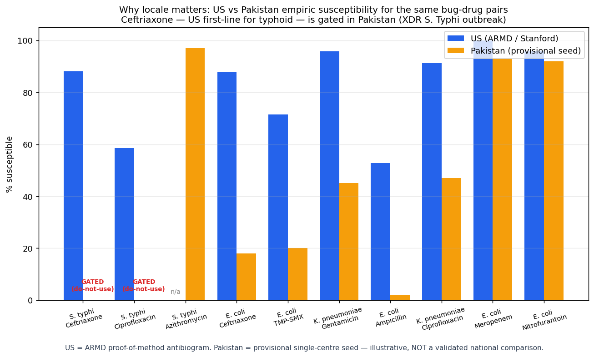
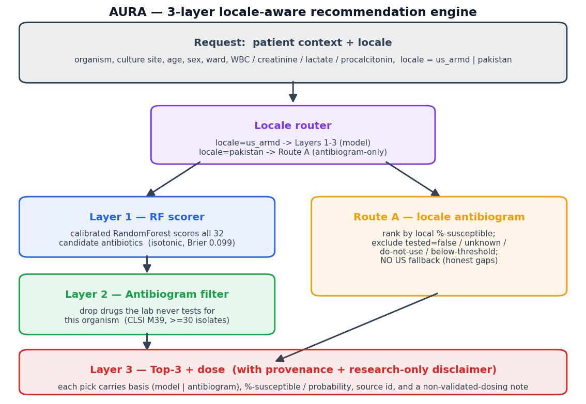

# AURA — Antibiotic AI Clinical Decision Support System

[](#)
[](#)
[-4caf50)](#)
[-f7931e?logo=scikitlearn)](#)
[](#)
[](#)

> **For academic and research use only. AURA does not replace a clinician, an antibiogram, or a microbiology lab. It must never be the sole basis for an antibiotic prescribing decision.**

---

## 1. What is AURA?

**AURA** is an end-to-end clinical decision support system (CDSS) that answers a single clinical question:

> *Given a patient, a culture site, and the organism that grew — which antibiotics is that organism most likely to be **susceptible** to, and at what dose and route?*

It does this in two stages:

1. **Susceptibility recommendation** — a machine-learning model scores every candidate antibiotic for the probability that the cultured organism is *susceptible* to it, given the patient's demographics, lab values, ward, and (where available) prior infection history. The candidates are first filtered through a data-derived **antibiogram** (the panel of drugs the lab actually tests for that organism), then ranked. The top 3 are returned. Probabilities are **isotonic-calibrated** (Brier 0.168 → 0.099), so the numbers shown are decision-grade, not just rankable scores (§10).
2. **Dosage recommendation** — each of the top-3 antibiotics is enriched with a **dose range** and **route** (IV / PO / IM) from a hybrid lookup-plus-ML dosage engine. *(Dosing is a reference reframe, not a validated dosing calculator — see §18.)*

The result is a ranked, dosed shortlist surfaced through a clean web UI, intended to *support* (never replace) a clinician's empirical-therapy decision while culture results are pending or being interpreted.

**Locale awareness (the headline V2 feature).** The same organism is not equally susceptible everywhere. AURA carries a **locale toggle** (`us_armd` ↔ `pakistan`): the US path runs the ML model + US antibiogram; the Pakistan path runs an **antibiogram-only route** driven by local resistance data, which *gates* drugs that fail locally even when they are first-line elsewhere. The flagship example: **ceftriaxone is standard first-line for typhoid in the US but is gated in Pakistan** because of the ongoing XDR *S.* Typhi outbreak. See §8 and the figure below.



AURA is a full-stack application:

- **Frontend** — Next.js 14 + TypeScript + Tailwind CSS. A single clinical-input form → ranked result cards + a full susceptibility chart, plus a model-info dashboard.
- **Backend** — FastAPI (Python 3.11) serving the model as a JSON API.
- **ML** — scikit-learn `RandomForest` pipelines trained on the **ARMD** (Antimicrobial Resistance Microbiology Dataset) clinical tables.

### Branch & version note

This repository has two parallel product lines living on different branches:

| Branch | Product | Status |
|---|---|---|
| `main` | **V1 — CatBoost** (per-antibiotic classifiers, Dryad dataset) | Maintained & deployed separately. |
| `version/v2_release` **(this branch)** | **V2 — ARMD RandomForest** recommender + hybrid dosage | **Active.** This is what this README documents. |

On this branch the entire V1 (CatBoost) stack is **commented out, not deleted** — the backend only mounts the V2 router (`/api/v2/*`). V1 is summarized as a legacy note in [§14](#14-v1-legacy-note-catboost--main-branch). Everything else in this README describes the **V2 ARMD system**.

---

## Contents

1. [What is AURA?](#1-what-is-aura)
2. [System architecture](#2-system-architecture)
3. [Repository layout](#3-repository-layout)
4. [Quick start](#4-quick-start)
5. [Datasets](#5-datasets)
6. [Data pipeline & feature engineering](#6-data-pipeline--feature-engineering)
7. [The recommendation model (V2)](#7-the-recommendation-model-v2)
8. [The 3-layer, locale-aware recommendation engine](#8-the-3-layer-locale-aware-recommendation-engine)
9. [The dosage model](#9-the-dosage-model)
10. [Model performance](#10-model-performance)
11. [Training the models](#11-training-the-models)
12. [How the system works end-to-end](#12-how-the-system-works-end-to-end)
13. [API reference](#13-api-reference)
14. [V1 legacy note](#14-v1-legacy-note-catboost--main-branch)
15. [Configuration](#15-configuration)
16. [Deployment](#16-deployment)
17. [Problems faced & how we fixed them](#17-problems-faced--how-we-fixed-them)
18. [Limitations](#18-limitations)
19. [Future work](#19-future-work)
20. [Contributing, license & references](#20-contributing-license--references)

---

## 2. System architecture

```
┌──────────────────────────────────────────────────────────────────────────────┐
│  Browser — Next.js 14 (TypeScript + Tailwind)                                 │
│                                                                                │
│  PatientForm ──► /api/v2/recommend ──► ResultCardV2 ×3  +  ResistanceChart     │
│  (culture site, organism, age, gender, WBC/Cr/lactate/PCT, ward)               │
└───────────────────────────────────┬────────────────────────────────────────────┘
                                    │  HTTPS / JSON
┌───────────────────────────────────▼────────────────────────────────────────────┐
│  FastAPI 0.104  (Python 3.11)        app version "1.0.0"                        │
│                                                                                │
│  GET  /api/v2/organisms   ─► ClinicalCatalogService   (culture → organism list) │
│  GET  /api/v2/locales     ─► LocaleAntibiogramService (US / Pakistan + orgs)     │
│  POST /api/v2/recommend   ─► locale router:                                      │
│         locale=us_armd  ─► ARMDPredictorService (3-layer engine) + DosageService │
│         locale=pakistan ─► Route A: LocaleAntibiogramService (antibiogram-only)  │
│  GET  /api/v2/model-info  ─► inventory + eval metrics + US-vs-PK contrast        │
│  GET  /health , GET /                                                           │
└───────────────────────────────────┬────────────────────────────────────────────┘
                                    │
              armd_model/artifacts/            (committed, loaded at startup)
              ├── rf_top3_recommender_calibrated.joblib  SERVED default (isotonic)
              ├── rf_top3_recommender_optimized.joblib   raw RF (fallback)
              ├── feature_cols / selected_antibiotics / best_threshold.joblib
              ├── feature_importances / split_test_summary.joblib
              ├── organism_antibiotic_panel.json          antibiogram filter
              ├── dose_route_lookup.csv                   exact dose lookup
              └── dose_model_hybrid.pkl / route_model_hybrid.pkl
              backend/antibiograms/            (per-locale resistance data)
              ├── us_armd.json                 ARMD proof-of-method antibiogram
              └── pakistan.json                provisional local seed (gates XDR drugs)
              reports/metrics.json             rigorous eval, served on /model-info
```

The backend services are constructed once at import time (`routes.py`) and reused across requests. The **calibrated** RF pipeline (`rf_top3_recommender_calibrated.joblib`) is the served default; the per-locale antibiograms and evaluation metrics are loaded at startup.

---

## 3. Repository layout

```
antibiotic-ai-cdss/
│
├── backend/                          FastAPI backend (V2 active)
│   ├── app/
│   │   ├── main.py                   App, CORS, middleware; mounts ONLY /api/v2
│   │   ├── api/routes.py             V2 routes (V1 routes commented out)
│   │   ├── schemas/request.py        Pydantic v2 schemas (V1 schemas commented out)
│   │   └── services/
│   │       ├── armd_predictor.py     RF recommender + antibiogram filter (Layers 1–3)
│   │       ├── dosage_service.py     Hybrid dose/route engine
│   │       ├── clinical_catalog.py   Culture-site → organism dropdown catalog
│   │       ├── predictor.py          V1 CatBoost service (DEPRECATED, banner-marked)
│   │       └── rules.py              V1 rule-based dosing (DEPRECATED)
│   ├── model/                        V1 artifacts (legacy; not loaded on this branch)
│   ├── tests/                        pytest (V2 tests active; V1 tests commented out)
│   ├── Dockerfile                    Backend image (used by Render)
│   └── requirements.txt              Pinned: scikit-learn==1.3.2 (see §17)
│
├── frontend/                         Next.js 14 frontend (V2-only UI)
│   ├── app/
│   │   ├── page.tsx                  Home — V2 form + results
│   │   └── model-info/page.tsx       Model performance dashboard
│   ├── components/
│   │   ├── PatientForm.tsx           V2 clinical input form
│   │   ├── ResultCardV2.tsx          V2 result card (prob + dose_range + route)
│   │   ├── ResistanceChart.tsx       Full per-antibiotic probability chart
│   │   ├── ResultCard.tsx            V1 card (commented out)
│   │   └── DisclaimerBanner.tsx
│   ├── services/api.ts               Axios client
│   └── types/index.ts
│
├── armd_model/                       V2 training & build pipeline
│   ├── train_armd.py                 (1) Train the RF recommendation model
│   ├── build_antibiogram.py          (2) Build the organism→antibiotic antibiogram
│   ├── train_dosage.py               (3) Train the hybrid dosage model
│   ├── artifacts/                    Generated artifacts (committed for deploy)
│   └── requirements.txt
│
├── training/                         V1 CatBoost pipeline (DEPRECATED on this branch)
│   ├── preprocess.py / train.py / evaluate.py
│   └── requirements.txt
│
├── datasets/                         ARMD source CSVs — NOT committed (see §5)
│
├── docs/                             Extended documentation
│   ├── API_REFERENCE.md / ARCHITECTURE.md / MODEL.md
│   ├── DEPLOYMENT.md / BUILD_STATUS.md
│   └── (legacy Colab scripts: armd_randomforest_top3_recommendation.py, dosage_model.py)
│
├── docker-compose.yml                Local full-stack run
├── .env.example
├── CHANGELOG.md / CONTRIBUTING.md / SECURITY.md / Makefile
└── README.md
```

> The two `docs/*.py` files (`armd_randomforest_top3_recommendation.py`, `dosage_model.py`) are the **original Colab notebooks**, kept for reference only. The maintained, runnable scripts are the three files in `armd_model/`.

---

## 4. Quick start

The trained V2 artifacts are committed to `armd_model/artifacts/`, so the app runs **without retraining**. You only need the raw datasets if you intend to retrain (§11).

### Docker (full stack)

```bash
git clone https://github.com/EponymousBearer/antibiotic-ai-cdss.git
cd antibiotic-ai-cdss
git checkout version/v2_release
cp .env.example .env
docker-compose up --build
```

| Service | URL |
|---|---|
| Frontend | http://localhost:3000 |
| Backend API | http://localhost:8000 |
| Swagger UI | http://localhost:8000/docs |
| Health check | http://localhost:8000/health |

### Manual setup

**Backend**

```bash
cd backend
python -m venv .venv && .venv\Scripts\activate    # macOS/Linux: source .venv/bin/activate
pip install -r requirements.txt                    # installs scikit-learn==1.3.2 (required, see §17)
uvicorn app.main:app --reload --port 8000
```

**Frontend**

```bash
cd frontend
npm install
echo "NEXT_PUBLIC_API_URL=http://localhost:8000" > .env.local
npm run dev
```

**Tests**

```bash
cd backend && pytest tests/ -v
```

> ℹ️ The `/api/v2/organisms` dropdown is richest when `datasets/microbiology_cultures_cohort.csv` is present (it derives the per-culture organism list from real data). Without it, the catalog and antibiogram fall back to a small built-in list.

---

## 5. Datasets

AURA V2 is trained on **ARMD** (Antimicrobial Resistance Microbiology Dataset) — a multi-table clinical microbiology dataset. The raw CSVs are **not committed** (size). Download them and place them in `datasets/`:

> **[Google Drive — AURA Datasets](https://drive.google.com/drive/folders/1agc1hXlVinXAPM-7E8RFfAFopKVrIota?usp=sharing)**

| File | Role in the pipeline |
|---|---|
| `microbiology_cultures_cohort.csv` | **Core.** One row per (patient culture × antibiotic) with `organism`, `culture_description`, `antibiotic`, `susceptibility`, `was_positive`. Source of the training label, the antibiogram, and the runtime organism dropdown. |
| `microbiology_cultures_demographics.csv` | `age` (banded → numeric), `gender`. |
| `microbiology_cultures_labs.csv` | Per-period medians: `median_wbc`, `median_cr`, `median_lactate`, `median_procalcitonin`. |
| `microbiology_cultures_antibiotic_class_exposure.csv` | Prior antibiotic-**class** exposure → `prior_abxclass__*` binary flags. |
| `microbiology_culture_prior_infecting_organism.csv` | Prior infecting organisms → `prior_org__*` binary flags. |
| `microbiology_cultures_ward_info.csv` | Ward flags → `ward__icu`, `ward__er`, `ward__ip`. |
| `d_dose.csv` | Drug dosing reference (dose ranges, routes, age bands, disease) → the dosage model. |

The label `susceptibility` is mapped to a binary target: **`Susceptible → 1`**, **`Resistant → 0`** (everything else dropped). Only positive cultures (`was_positive`) and the 32 selected antibiotics are kept.

---

## 6. Data pipeline & feature engineering

`armd_model/train_armd.py` runs an 8-step pipeline that merges the ARMD tables into a single modelling matrix. Highlights:

**Cohort filtering**
- Keep only **positive** cultures (`was_positive ∈ {1, true, t, yes, y, positive}`).
- Normalize antibiotic names (lowercase, strip, `_`/`-` → space) and keep only the **32 selected antibiotics**.
- Map `susceptibility` → binary `target` and drop rows missing `anon_id`, `organism`, `culture_description`, `antibiotic`, or `target`.

**Age normalization** — ARMD stores age as **bands** (e.g. `65-74 years`, `85+ years`, `less than 1 year`). `convert_age_to_numeric()` maps each band to a representative midpoint (e.g. `65-74 years → 69.5`, `85+ years → 90`, `<1 year → 0.5`) so age is usable as a numeric feature.

**Lab values** — the labs file stores medians as `median_wbc` / `median_cr` / `median_lactate` / `median_procalcitonin` and uses the literal string `'Null'` for missing values. These are renamed to the model's `*_median` feature names and, since a patient can have several period rows, collapsed to one row per patient by **averaging** the available medians.

**Prior history (memory-safe, chunked)** — the exposure and prior-organism files are large, so they're read in 150 k-row chunks. For each patient we build a *set* of prior antibiotic **classes** and prior **organisms**, then one-hot them into `prior_abxclass__*` and `prior_org__*` flags (top-50 organisms by frequency retained).

**Ward** — `hosp_ward_ICU/ER/IP` booleans → `ward__icu`, `ward__er`, `ward__ip`.

**Sparsity reduction** — rare categories are collapsed: top-40 organisms and top-25 culture sites kept (everything else → `other`); binary feature columns capped at 120 (by frequency).

**Final feature matrix — 46 columns:**

| Group | Count | Columns |
|---|---:|---|
| Categorical | 4 | `culture_description`, `organism`, `antibiotic`, `gender` |
| Numeric | 5 | `age`, `wbc_median`, `cr_median`, `lactate_median`, `procalcitonin_median` |
| Binary | 37 | 18 × `prior_abxclass__*`, 16 × `prior_org__*`, 3 × `ward__*` |

The key design choice is that **`antibiotic` is itself a feature**, not a separate model per drug. This is what lets a single RandomForest score *any* antibiotic for *any* organism and learn organism × antibiotic interactions (see §7).

**Preprocessing (sklearn `ColumnTransformer`):**
- Categorical → `SimpleImputer(most_frequent)` → `OneHotEncoder(handle_unknown='ignore')`. One-hot (not ordinal) is deliberate: it lets the forest split on a *specific* organism/antibiotic/culture value instead of treating them as arbitrary integers.
- Numeric + binary → `SimpleImputer(median)`.

**Patient-grouped splitting** — the data is split with `GroupShuffleSplit` **grouped by `anon_id`** so the same patient never appears in more than one split. Row-level splitting would leak patient signal across train/test and inflate metrics. Split sizes: **test 20 %**, **validation 15 % of the remaining 80 %**, **train ≈ 68 %**. The script asserts zero patient overlap across all three splits.

---

## 7. The recommendation model (V2)

A **single scikit-learn `RandomForestClassifier`** wrapped in a `Pipeline` with the preprocessor above.

| Hyperparameter | Value | Rationale |
|---|---|---|
| `n_estimators` | **150** | Sized to fit the Render free tier (512 MB RAM) and stay under GitHub's 100 MB file limit after `compress=3`. |
| `max_depth` | **16** | Same RAM/size budget; deeper trees bloat the artifact. |
| `min_samples_leaf` | **4** | Regularization against overfitting on rare organism×drug combos. |
| `max_features` | `'sqrt'` | Standard RF decorrelation. |
| `class_weight` | `'balanced_subsample'` | The target is imbalanced toward *susceptible*. |
| `random_state` | `42` | Reproducibility. |

**Decision threshold** — the operating threshold is tuned on the **validation** split, sweeping 0.20–0.80. The configurable policies are `balanced` (max balanced accuracy), `recall_first` (max recall subject to precision ≥ 0.85), and `f1`. The shipped artifact was trained with the **`balanced`** policy, which selected a threshold of **0.50**. (The threshold is used for binary metrics and the optional candidate cut-off; the API ranks by *absolute* probability and always returns the top 3.)

The 32 antibiotics the model scores:

```
amikacin, ampicillin, aztreonam, cefazolin, cefepime, cefotaxime, cefoxitin,
cefpodoxime, ceftazidime, ceftriaxone, cefuroxime, chloramphenicol, ciprofloxacin,
clarithromycin, clindamycin, doripenem, doxycycline, ertapenem, erythromycin,
fosfomycin, gentamicin, levofloxacin, linezolid, meropenem, metronidazole,
moxifloxacin, nitrofurantoin, streptomycin, tetracycline, tigecycline, tobramycin,
vancomycin
```

---

## 8. The 3-layer, locale-aware recommendation engine



**Layer 0 — Locale router.** Every request carries a `locale`. `locale=us_armd` runs the ML path below (Layers 1–3). Any other locale (currently `pakistan`) is routed to **Route A**, an antibiogram-only path served by `LocaleAntibiogramService`: candidates are ranked purely by the **local %-susceptible** figure and any drug that is untested, unknown, below the isolate threshold, or explicitly `do_not_use` in that locale is **excluded** — with **no US fallback**, so honest data gaps stay visible rather than being papered over with US numbers. This is what lets AURA *gate* ceftriaxone for typhoid in Pakistan (XDR outbreak) while surfacing it in the US. Each pick returns its `basis` (`model` vs `antibiogram`), `percent_susceptible`, and `source_id` provenance. Locale antibiograms live in `backend/antibiograms/*.json`; the Pakistan file is a **provisional single-centre seed**, not a validated national antibiogram.

The ML path (`armd_predictor.py → predict()`) then flows through three layers:

**Layer 1 — Probability scoring.** For each candidate antibiotic, a feature row is built from the patient context with `antibiotic` set to that drug, and the **calibrated** RF pipeline produces a decision-grade `P(susceptible = 1)`. (Features not captured by the UI — prior history — default to 0.)

**Layer 2 — Antibiogram clinical filter.** Candidates are restricted to the antibiotics the lab **actually tests for that organism**, using a data-derived antibiogram (`organism_antibiotic_panel.json`, built by `build_antibiogram.py`). A drug is "allowed" for an organism only if the (organism, antibiotic) pair was tested **≥ 30 times** in the cohort — the **CLSI M39** minimum for antibiogram reporting. This prevents clinically nonsensical drugs (e.g. *metronidazole* vs *E. coli*, *ertapenem* vs *Pseudomonas*) from ever topping the list just because the model assigned them a high probability. The shipped panel covers **85 organisms** (panel size: min 1, median 7, max 22 drugs). Unknown organisms fall back to the full 32-drug panel rather than returning nothing.

**Layer 3 — Ranking.** The allowed candidates are sorted by absolute `P(susceptible)` descending. The **top 3** become recommendations; the full sorted list is returned as `all_predictions` (drives the frontend chart).

This layered design is the core safety mechanism: the ML model proposes, the antibiogram disposes, and the ranking presents.

---

## 9. The dosage model

Each top-3 antibiotic is enriched with a **dose range** and **route** by `dosage_service.py`, trained by `train_dosage.py` from `d_dose.csv`.

**Keying.** The dose table is keyed by `(generic, disease, age_group)`. Age is bucketed into `child` (<12), `adult` (12–64), `elderly` (≥65). Because the recommender works in culture **sites** but `d_dose` is keyed by **disease**, a site→disease map bridges them:

| Culture site | Mapped disease |
|---|---|
| `urine` | Urinary Tract Infection |
| `blood` | Bacteremia |
| `respiratory` | Pneumonia |

**Hybrid resolution (in priority order):**
1. **Exact lookup** — `dose_route_lookup.csv` (840 collapsed rows; most-frequent dose/route per key). Used only when it carries a *real* (non-`unknown`) value.
2. **ML fallback** — two `RandomForestClassifier`s (500 trees each, one for dose range, one for route) for unseen `(generic, disease, age_group)` combinations.
3. **Static fallback** — a built-in clinical dosing table covering all 32 antibiotics, so the API **never surfaces "unknown"**.

Each recommendation reports its `dose_source` (`lookup` / `model` / `fallback`). Routes are `IV`, `PO`, or `IM`.

---

## 10. Model performance

### Recommendation model — held-out test set (threshold 0.50)

These are the **actual** metrics in the shipped artifact (`split_test_summary.joblib`), reported for the *susceptible = 1* class:

| Metric | Value |
|---|---:|
| ROC AUC | **0.851** |
| Accuracy | **0.788** |
| Balanced accuracy | **0.774** |
| Precision (S) | **0.942** |
| Recall (S) | **0.794** |
| F1 (S) | **0.862** |

High precision with moderate recall means: when AURA says an isolate is susceptible, it is usually right — at the cost of occasionally missing a susceptible drug. Combined with the antibiogram filter, this biases the shortlist toward drugs that will actually work.

### Rigorous evaluation (honest headline)

`armd_model/evaluate.py` regenerates a seeded, patient-grouped evaluation into `reports/metrics.json` (also served live on `/model-info`). The headline is deliberately **honest**, not flattering:

| Measure | Value | What it means |
|---|---:|---|
| RF pooled ROC-AUC | **0.851** | Discriminates S vs R well overall. |
| Antibiogram baseline AUC | **0.860** | A "just use the local %-susceptible" baseline is *as good or better* pooled — so the pooled number alone doesn't justify ML. |
| RF lift over antibiogram (pooled) | **−0.009** | Honestly negative pooled. |
| **Within-(organism×drug) median AUC** | **0.650** | This is the real story: *inside* a cell the antibiogram is constant (AUC 0.5), so 0.650 is the RF's **patient-specific lift** — it re-ranks *this* patient beyond the population rate. 80% of cells beat 0.55; 67% beat 0.60. |
| Calibration Brier | **0.168 → 0.099** | Isotonic calibration; the served model. |
| Top-1 / Top-3 hit-rate (informative) | **0.983 / 0.998** | On contexts with both an S and an R drug tested, the top-ranked pick is susceptible ~98% of the time. |

> **Coverage-rate-vs-clinician** is *not computable* from ARMD (it records the drug *tested*, not the drug *administered* — no prescribed-drug field), so per the roadmap the Top-k susceptibility hit-rate is reported as the honest substitute.

### Figures (`reports/figures/`, also on `/model-info` and `frontend/public/figures/`)

| Figure | Shows |
|---|---|
| `per_organism_auc.png` | Per-organism RF vs antibiogram AUC (top 15 by support). |
| `organism_drug_auc_heatmap.png` | Within-(organism×drug) RF AUC — where the patient-specific lift lives. |
| `calibration_reliability.png` | Reliability diagram, uncalibrated vs isotonic. |
| `decision_curve.png` | Net benefit vs treat-all / treat-none. |
| `topk_coverage.png` | Top-1/Top-3 susceptibility hit-rate (coverage substitute). |
| `us_vs_pk_contrast.png` | US vs Pakistan %-susceptible for the keystone divergence cells. |
| `architecture_3layer.png` | The locale-aware engine (embedded in §8). |

The first four come from `evaluate.py` (needs the cohort); the last three from `make_thesis_figures.py` (needs only committed artifacts — see §11).

### Most important features

Feature importance is dominated by **antibiotic identity** (the drug-specific base susceptibility), then **organism**, then labs/demographics:

| Rank | Feature | Importance |
|---:|---|---:|
| 1 | `antibiotic = ampicillin` | 0.195 |
| 2 | `antibiotic = tetracycline` | 0.090 |
| 3 | `antibiotic = meropenem` | 0.071 |
| 4 | `antibiotic = ertapenem` | 0.070 |
| 5 | `antibiotic = amikacin` | 0.060 |
| 6 | `organism = escherichia coli` | 0.026 |
| 7 | `antibiotic = nitrofurantoin` | 0.026 |
| 8 | `organism = klebsiella pneumoniae` | 0.022 |
| 9 | `cr_median` (creatinine) | 0.017 |
| 10 | `age` | 0.012 |

The top-10 feature importances are also served live at `GET /api/v2/model-info`.

---

## 11. Training the models

Place the ARMD CSVs in `datasets/` (§5), then run the three scripts **in order**. Use scikit-learn **1.3.2** so the artifacts unpickle in the backend (§17).

```bash
cd armd_model
pip install -r requirements.txt        # NOTE: pin scikit-learn==1.3.2 to match backend
```

**Step 1 — recommendation model**

```bash
python train_armd.py
```
Reads the 6 ARMD CSVs, builds the 46-feature matrix, does the patient-grouped split, trains the RF, tunes the threshold, evaluates the held-out test set + Top-3 metrics, and writes:
```
rf_top3_recommender_optimized.joblib   feature_cols.joblib
selected_antibiotics.joblib            best_threshold.joblib
feature_importances.joblib             split_test_summary.joblib
metadata_optimized.json
```

**Step 2 — antibiogram filter**

```bash
python build_antibiogram.py
```
Reads `microbiology_cultures_cohort.csv`, computes each (organism, antibiotic) test count, keeps pairs with **≥ 30 isolates** (CLSI M39), and writes `organism_antibiotic_panel.json`.

**Step 3 — dosage model**

```bash
python train_dosage.py
```
Reads `d_dose.csv`, builds the exact lookup table, trains the RF dose/route fallback models, and writes `dose_route_lookup.csv`, `dose_model_hybrid.pkl`, `route_model_hybrid.pkl`. (Optionally batch-evaluates against `datasets/manual_test_cases_unambiguous.csv` if present.)

Restart the backend after retraining; artifacts are loaded once at startup.

**Step 4 — rigorous evaluation + figures (recommended)**

```bash
python armd_model/evaluate.py            # cohort required; writes reports/metrics.json + 4 eval figures,
                                         # and (re)saves the calibrated served model
python armd_model/make_thesis_figures.py # cohort NOT required; reads metrics.json + antibiograms
                                         # → topk_coverage, us_vs_pk_contrast, architecture_3layer
```

`evaluate.py` uses the same seed-42, patient-grouped split as training and asserts the RF AUC hasn't drifted from the frozen baseline. `make_thesis_figures.py` reads only committed artifacts, so it reproduces the poster/thesis figures anywhere (no datasets). Both write into `reports/figures/` and mirror the examiner figures into `frontend/public/figures/` for the `/model-info` dashboard.

---

## 12. How the system works end-to-end

```
1. Clinician opens the app → PatientForm loads culture sites + organisms
   from GET /api/v2/organisms (data-derived catalog).

2. Clinician picks culture site → organism dropdown filters to organisms
   actually seen at that site. Enters age, gender, ward, optional labs.

3. Submit → POST /api/v2/recommend
     ├─ Validate: culture site supported? organism valid for that site?
     ├─ Map ward enum → ward__icu / ward__er / ward__ip flags
     ├─ ARMDPredictorService.predict()
     │     Layer 1  score all candidates with the RF  →  P(susceptible)
     │     Layer 2  filter to the organism's antibiogram panel (≥30 isolates)
     │     Layer 3  rank by probability  →  top 3 + full list
     └─ DosageService.get_dosage() for each of the top 3
           lookup → ML → static fallback  →  dose_range + route + source

4. Response → ResultCardV2 ×3 (drug, probability, dose range, route)
            + ResistanceChart (every scored antibiotic, sorted).
```

---

## 13. API reference

Base path: `/api/v2`. Full detail: [`docs/API_REFERENCE.md`](docs/API_REFERENCE.md). Interactive docs at `/docs` (Swagger) and `/redoc`.

| Method | Endpoint | Description |
|---|---|---|
| `GET` | `/api/v2/organisms` | Culture sites and (optionally, via `?culture_description=`) the valid organisms for a site. |
| `GET` | `/api/v2/locales` | Available locales (`us_armd`, `pakistan`), each with its selectable organisms and a `has_data` flag. Drives the UI locale toggle + organism dropdown. |
| `POST` | `/api/v2/recommend` | Top-3 recommendations + dose range + route + full ranked list. Add `locale` to switch paths (default `us_armd`). |
| `GET` | `/api/v2/model-info` | Model inventory, feature groups, held-out test metrics, top feature importances, dosage-model status, plus the rigorous `evaluation` block and the `us_vs_pk_contrast` chart data. |
| `GET` | `/health` | Liveness probe. |
| `GET` | `/` | API metadata. |

**Request** — `POST /api/v2/recommend`

```json
{
  "culture_description": "urine",
  "organism": "klebsiella pneumoniae",
  "age": 45,
  "gender": "female",
  "wbc": 12.5,
  "cr": 1.2,
  "lactate": 1.8,
  "procalcitonin": 2.5,
  "ward": "er"
}
```

| Field | Type | Required | Notes |
|---|---|---|---|
| `culture_description` | string | ✅ | Must be a supported culture site. |
| `organism` | string | ✅ | Must be valid for the culture site (or `other`); lowercased internally. |
| `age` | int (0–150) | ✅ | |
| `gender` | string | ✅ | `male` / `female`. |
| `wbc`, `cr`, `lactate`, `procalcitonin` | float ≥ 0 | optional | Missing → imputed. |
| `ward` | enum | optional | `general` (→ IP), `icu`, `er`. Default `general`. |
| `prior_abx_classes` | string[] | optional | Prior antibiotic-class exposure (values from `/model-info → prior_history_options`). US path only; unknown tokens ignored. |
| `prior_organisms` | string[] | optional | Prior infecting organisms (same source). US path only. |
| `locale` | string | optional | `us_armd` (default, ML path) or `pakistan` (antibiogram-only Route A). |

On the US path each recommendation also carries `explanation` — top TreeSHAP factors `[{feature, label, contribution, direction}]` for that drug's score (null if `shap` is unavailable on the host).

On the Pakistan path the response is additive: `locale`, `basis` (`antibiogram`), `excluded` (drug → gate reason), `antibiogram_meta` (source/version), and `dose_disclaimer`. The `POST /api/v2/recommend` contract is unchanged for the US default — new fields are only *added*.

**Response**

```json
{
  "recommendations": [
    {
      "antibiotic": "meropenem",
      "probability": 0.871,
      "dose_range": "500-1000 mg",
      "route": "IV",
      "dose_source": "lookup"
    }
  ],
  "patient_factors": { "culture_description": "urine", "organism": "klebsiella pneumoniae", "age": 45, "...": "..." },
  "culture_description": "urine",
  "all_predictions": [ { "antibiotic": "meropenem", "probability": 0.871 }, "..." ]
}
```

**Error codes:** `422` unsupported culture site / organism · `503` model not loaded (artifacts missing) · `500` server error. Every response carries an `X-Request-ID` header.

---

## 14. V1 legacy note (CatBoost — `main` branch)

V1 is the **original** product and remains live on the `main` branch with its own deployment. On *this* branch it is fully commented out and not mounted.

- **Algorithm:** 23 per-antibiotic **CatBoost** binary classifiers, trained on ~22,946 **Dryad** microbiology samples (3 antibiotics excluded for AUC < 0.65).
- **Inputs:** organism, age, gender, kidney function, severity.
- **Dosing:** rule-based engine (dose, route, frequency, duration, clinical notes).
- **Explainability:** SHAP per prediction (`/api/v1/explain`).
- **Code on this branch:** `backend/app/services/predictor.py` & `rules.py` (banner-marked deprecated), V1 routes/schemas commented in `routes.py`/`request.py`, V1 training in `training/`.

To work on V1, switch to `main`. **Do not re-enable V1 on `version/v2_release`** — the disabling is intentional. Full V1 metrics live in [`docs/MODEL.md`](docs/MODEL.md).

---

## 15. Configuration

Copy `.env.example` → `.env`. Variables actually read by the V2 backend:

| Variable | Default | Used by | Description |
|---|---|---|---|
| `ENVIRONMENT` | `development` | Backend | Startup log label. |
| `ALLOWED_ORIGINS` | `http://localhost:3000` | Backend | CORS allowlist (comma-separated). |
| `ARMD_ARTIFACTS_DIR` | `<repo>/armd_model/artifacts` | Backend (V2) | Where the RF + dosage + antibiogram artifacts are loaded from. |
| `ARMD_COHORT_PATH` | `<repo>/datasets/microbiology_cultures_cohort.csv` | Backend (V2) | Cohort used to build the runtime organism catalog. |
| `ANTIBIOGRAM_DIR` | `<repo>/backend/antibiograms` | Backend (V2) | Per-locale antibiogram JSONs (`us_armd.json`, `pakistan.json`). |
| `REPORTS_DIR` | `<repo>/reports` | Backend (V2) | Where `metrics.json` (the `/model-info` evaluation block) is read from. |
| `ENABLE_SHAP` | on in dev, **off in production** | Backend (V2) | Per-drug TreeSHAP explanations (M3/T3.1). Defaults off when `ENVIRONMENT=production` because shap/numba can OOM a 512 MB host; set `ENABLE_SHAP=1` to force on (only on an instance with headroom). |
| `NEXT_PUBLIC_API_URL` | `http://localhost:8000` | Frontend | Client-side API base URL. |
| `API_URL` | `http://backend:8000` | Frontend (Docker) | Server-side API URL. |

> `MODEL_PATH` / `MODEL_METADATA_PATH` belong to the V1 CatBoost service and are not used on this branch.

---

## 16. Deployment

Full guide: [`docs/DEPLOYMENT.md`](docs/DEPLOYMENT.md).

| Target | How |
|---|---|
| **Local (full stack)** | `docker-compose up --build`. |
| **Backend → Render** | Build from `backend/Dockerfile` as a free-tier web service (health check `/health`). The image bundles the **calibrated** RF model (17.5 MB), both antibiograms, and `reports/metrics.json`; the RF is sized (150 trees / depth 16 / `compress=3`) to fit the 512 MB free tier. Set `ALLOWED_ORIGINS` to the Vercel URL and `ENVIRONMENT=production`. |
| **Frontend → Vercel** | Set the project **Root Directory = `frontend`** (no root `vercel.json`). Set `NEXT_PUBLIC_API_URL` to the Render backend URL. |

---

## 17. Problems faced & how we fixed them

A running log of the non-obvious issues hit while building V2 and how each was resolved:

| Problem | Symptom | Fix |
|---|---|---|
| **scikit-learn version drift** | `/api/v2/recommend` 500s: `SimpleImputer has no attribute _fill_dtype`. Newer sklearn can't unpickle 1.3.2 artifacts. | **Pinned `scikit-learn==1.3.2`** in `backend/requirements.txt`. Train with the same version. |
| **Lab values silently dropped** | Labs never influenced predictions. | The labs file uses `median_wbc`/`median_cr`/… (not `wbc_median`). Added `LAB_COLUMN_MAP` to rename on load so they merge into the model. |
| **`'Null'` literal in labs** | Lab columns read as strings, not numbers. | `na_values=['Null']` on read so they parse as float NaN. |
| **Patient data leakage** | Inflated, untrustworthy metrics. | Switched to `GroupShuffleSplit` grouped by `anon_id`; assert no patient straddles splits. |
| **Categoricals collapsing to a global prior** | RF couldn't learn organism×antibiotic interactions. | Replaced `OrdinalEncoder` with `OneHotEncoder(handle_unknown='ignore')` so the forest splits on specific values. |
| **Artifact too big for free hosting** | Render OOM (512 MB) / GitHub 100 MB file limit. | Reduced to 150 trees / depth 16 and `joblib.dump(..., compress=3)`. |
| **Clinically nonsensical top picks** | Drugs never tested for an organism (e.g. metronidazole vs *E. coli*) ranking highly. | Added the **antibiogram filter** (`build_antibiogram.py`, CLSI M39 ≥30 isolates) as Layer 2. |
| **Dose lookups missing / `unknown`** | Recommendations showed "unknown" doses. | Hybrid resolution: exact lookup → ML model → static fallback; `unknown` values treated as misses. |
| **Site vs disease key mismatch** | Dose lookups never hit. | Map culture site → disease (urine→UTI, blood→Bacteremia, respiratory→Pneumonia); lowercase keys for matching. |
| **Memory blow-ups on big tables** | Exposure/prior-organism files too large to load. | Chunked reads (150 k rows) + set aggregation + width caps. |
| **Vercel 404 / Render config conflict** | Frontend 404; deploy conflicts. | Removed root `vercel.json` (use Root Directory = `frontend`) and the conflicting `render.yaml`; backend deploys via `backend/Dockerfile`. |

---

## 18. Limitations

- **No pooled lift over the antibiogram.** Pooled, the RF does *not* beat a "use the local %-susceptible" baseline (AUC 0.851 vs 0.860). The defensible value is the **within-cell, patient-specific re-ranking** (median cell AUC 0.650), not a headline accuracy win. This is stated honestly rather than hidden.
- **Prior history is optional and coarse.** Prior antibiotic-class exposure and prior organisms are now captured in the UI (US model path) and flow to the model — enabling them recovers ~+0.013 AUC that was previously discarded (`reports/history_ablation.json`). But they're still self-reported class/organism *flags*, not a full timestamped medication/culture history; when left blank the model assumes no known history.
- **Pakistan antibiogram is a provisional seed.** `pakistan.json` is mostly single-centre / literature-anchored with explicit `unknown` gaps and TODO placeholders for national PARN/NIH/GLASS data — it is illustrative of the *method*, not a validated national antibiogram. Several organisms return "no local data" by design rather than guessing.
- **Dosing is a reference reframe, not a validated calculator.** Dose/route depend on `(drug, mapped-disease, age band)` — not weight, renal function, or full indication — and are surfaced with a non-validated-dosing disclaimer. Always verify against a pharmacist/formulary.
- **Explanations are attributions, not causes.** Per-drug TreeSHAP factors (US path) show what moved *this model's* score; they aggregate one-hot columns into clinical groups and are best-effort (omitted if `shap` can't load on the host). They explain the model, not the biology.
- **Dataset-bound.** The model is trained on one US institution's ARMD data; resistance patterns are local and time-bound. No external validation.
- **Not for autonomous prescribing.** Clinician judgment, local antibiograms, and stewardship policy always take precedence.

---

## 19. Future work

- Replace the Pakistan seed antibiogram with **national PARN / NIH-Pakistan / WHO GLASS** figures and fill the `unknown` cells.
- Concept-drift detection + automated retraining.
- External validation on an independent hospital dataset.
- Auth, audit logging, and polymicrobial-infection support.
- RF vs LightGBM vs CatBoost comparison on the same split (roadmap M2, stretch).

*Done in V2 (previously listed here): isotonic probability calibration; rigorous seeded evaluation with figures; locale-aware US↔Pakistan recommendation; prior antibiotic-exposure / prior-organism inputs wired to the model; per-prediction TreeSHAP explanations.*

---

## 20. Contributing, license & references

**Contributing** — see [`CONTRIBUTING.md`](CONTRIBUTING.md). Work happens on `version/v2_release` (or feature branches off it); **never push to `main`** (it is the independent V1 product line).

**References**
- Breiman, L. *Random Forests.* Machine Learning, 45(1), 5–32, 2001.
- CLSI. *M39 — Analysis and Presentation of Cumulative Antimicrobial Susceptibility Test Data.*
- IDSA Clinical Practice Guidelines. [idsociety.org](https://www.idsociety.org/practice-guideline/)
- Prokhorenkova et al. *CatBoost: gradient boosting with categorical features support.* NeurIPS, 2018 (V1). [arXiv:1810.11363](https://arxiv.org/abs/1810.11363)
- Dryad Digital Repository (V1 dataset). [datadryad.org](https://datadryad.org/)

**License** — [MIT](LICENSE) © AURA Project Contributors

---

> **Disclaimer:** AURA is for educational and research purposes only. It must not be used as the sole basis for antibiotic prescribing. Always confirm recommendations against current microbiology results, local resistance patterns, institutional stewardship protocols, and specialist guidance.
